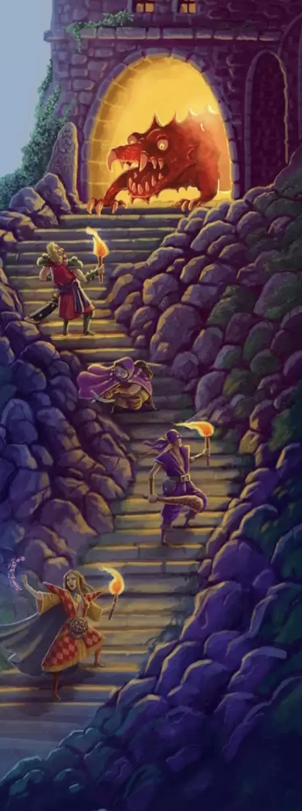
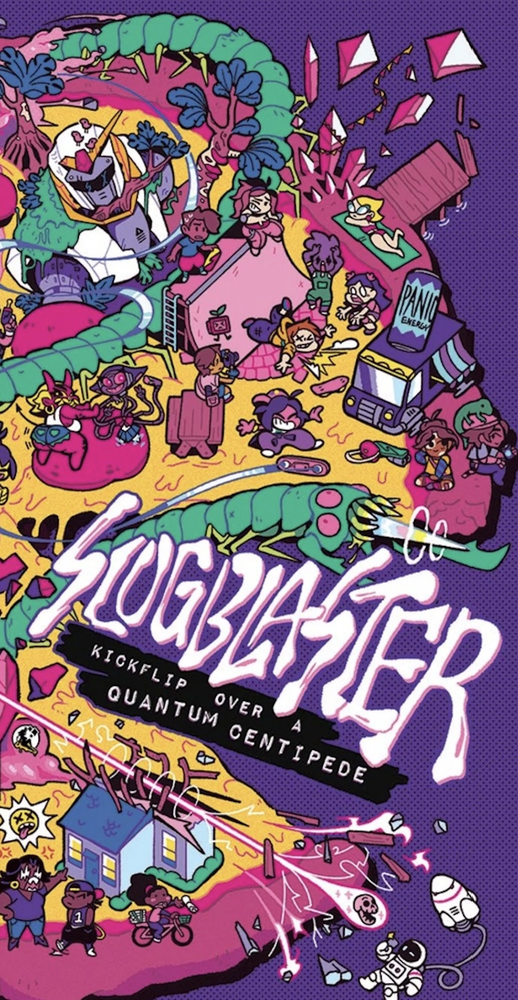
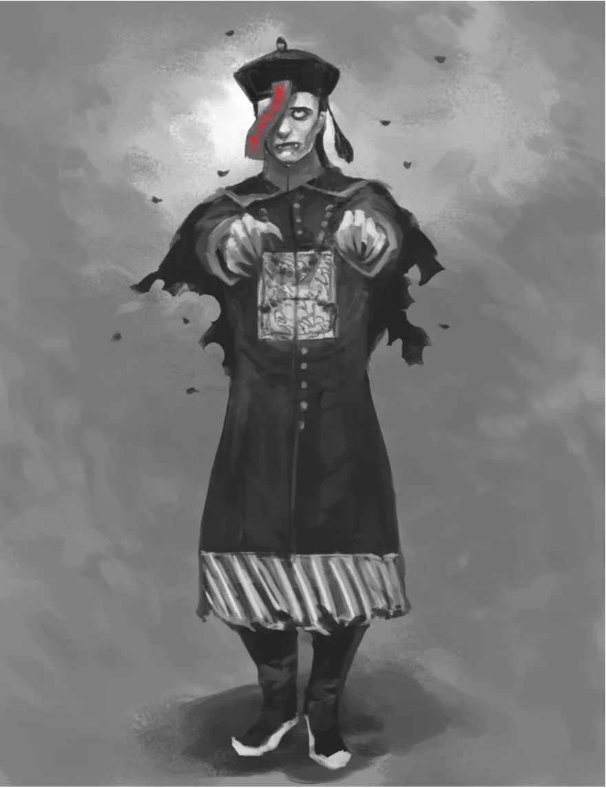
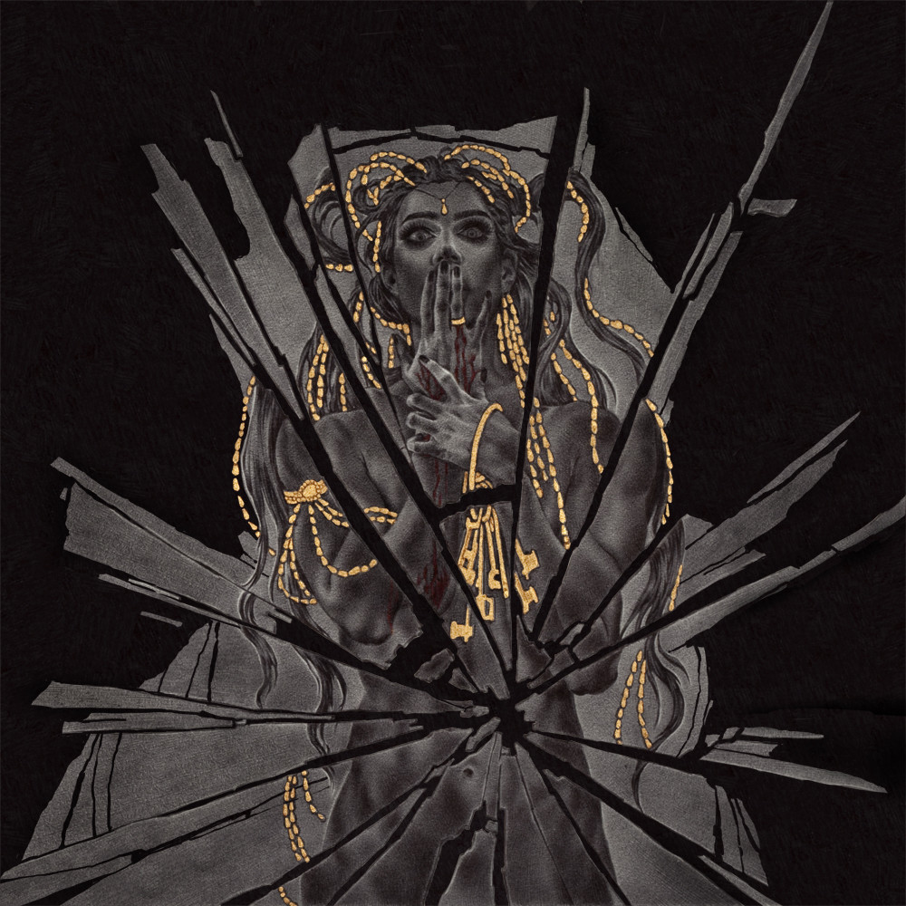

<!-- Main -->

<!-- One -->
<section id="one" markdown="1">

On **Wed 09/23** we will run five contemporary role-playing games at five stations across the Gameroom — one game per station, five students at each, ~45 minutes of play — followed by a cross-group debrief. You'll play one game in depth, and leave the session with at least a passing familiarity with central design moves of the others.

Review this page during class on **Wed 09/16**, when you'll rank your top three choices on an index card. Use it also as a reference over the long weekend while reading the sourcebook for your assigned game.

The games are listed here in a deliberate order — smallest to largest — because scale is one of the things worth noticing across the sampling. Your own design project will need to be scaled very deliberately too.

</section>

<!-- Two -->
<section id="two" class="spotlights" markdown="1">

<section markdown="1">

## Alone Among the Stars

*a solo game about exploring fantastic planets*

**What it's about:** You are a solitary traveler hopping from planet to planet, and each world has things on it that nobody has ever seen. There is no enemy, no mission, and no way to win. You keep a ship's log.

**How it works:** A planet is a small stack of face-down playing cards — roll a d6 for how many. To discover something, roll again: on 1–2 it's arduous to get to, on 3–4 you come upon it suddenly, on 5–6 you spot it while resting. Then flip a card. The suit says what kind of thing it is (diamonds are living beings, clubs are plants, hearts are ruins, spades are natural phenomena) and the rank says where it is — ace, in a field taller than you; nine, deep underground; king, floating in the air. Write a few sentences: what it is, and how you felt. Name the planet when you're done with it. Find another.

***"Play until you are tired, and want to return home. If you want to remember your travels, save the journal. If the memories bring you pain, burn it."***

**What it will teach you:** How small a complete game can be, and how much an oracle can generate from very little — four suits and thirteen ranks make fifty-two prompts the designer never had to write.

**Player Configuration:** Solo, no GM — all five of you will play in parallel at the same table and read your logs to each other afterward. 

**Reading:** one page. 

**Content warnings:** none.

</section>

<section markdown="1">

## Maze Rats

*fantasy adventure, exploration, problem-solving, survival*

**What it's about:** Dungeons, wilderness, a city, and a world that will kill you. This is the direct descendant of the game we rolled up in week one — the OSR line out of old D&D — stripped to its studs. Characters are fragile and disposable; the fun is in outthinking the situation rather than out-statting it.

**How it works:** Three abilities: Strength, Dexterity, Will. When something is risky, make a Danger Roll — 2d6 plus the relevant ability, 10 or higher and you avoid the danger. Four health at level one. Combat is 2d6 plus attack bonus against armor, and the damage is the difference between the two numbers. There is no spell list: you roll on tables of Effects, Elements and Forms and invent the spell on the spot. Nearly everything else in the fourteen pages is a table of thirty-six things — dungeon entrances, monster tactics, NPC goals, misfortunes, inn quirks.

***"Maze Rats PCs are very minimalistic because the character sheet is mostly there for when players make a mistake. Players are not meant to solve problems with dice rolls, but with their own ingenuity."***

**What it will teach you:** Dice tables as a design technology. Thirty-six words in a column can do work that a hundred pages of setting cannot, because the juxtapositions generate content the designer doesn't have to write.

**Player Configuration:** One GM, up to four players. 

**Reading:** 14 pages — read the rules pages closely, skim the tables. 

**Content warnings:** cartoonish violence; and note that the tables headed *Insanities* and *Mutations* use language around mental illness and disability that's worth attending to with critical attention.

</section>

<section markdown="1">

## Slugblaster: Turbo

*teenagers, hoverboards, other dimensions*

**What it's about:** "In the small town of Hillview, teenage hoverboarders sneak into other dimensions to explore, film tricks, go viral, and get away with the problems at home. It's dangerous. It's stupid. It's got parent groups in a panic. And it's the coolest thing ever."

**How it works:** One d6 per action. A 6 succeeds. A 4–5 succeeds but there's a problem. A 1–3 fails and there's a problem anyway. You track two things: Trouble and Style. You can dodge any problem by saying "Nope!" and marking 2 Trouble, or raise the stakes by saying "Check it!" to add a trick — worse if it goes wrong, but a Style if it doesn't. Fill your Trouble track and you *peelback*: traumatically yanked home through spacetime. Afterwards you spend Style on the epilogue — a viral video, a record, a new friend, a sponsorship.

***"Go gonzo, stay grounded. It's Into the Spider-Verse, not Looney Tunes."***

**What it will teach you:** How a game enforces its own tone by making the flashy, stupid choice mechanically attractive. Two currencies, pulling in opposite directions, and the aesthetic falls out of the arithmetic.

**Player Configuration:** GM plus three to five players. 

**Reading:** Turbo one-sheet contains three sheets — player, GM, and a run sheet with a scenario already prepped. 

**Content warnings:** teen risk-taking, mild peril, nobody dies. Note that Turbo is a free demo of a much larger game, check out the [full rulebook](https://online.anyflip.com/tedhi/tzgs/mobile/index.html).

</section>

<section markdown="1">

## Jiangshi: Blood in the Banquet Hall

*a multi-generational family, a restaurant, and hopping vampires*

**What it's about:** "A game about a Chinese family making their living by running a restaurant in one of North America's Chinatowns, circa 1920… Players take on the roles of members of the Chinese family, spanning three generations, who face threats of jiangshi (hopping vampires) at night and racism by day." Two threats, two shifts, one family.

**How it works:** Play runs on a Restaurant board with a Day/Night tracker, and the family's d8s go onto whichever phase you're working. Character sheets carry Skills, Facets, Hopes and Dreams, dialect, generation, and hours of labor. The restaurant itself has eight slots, and as they fill it decays — "when all slots (slots 1–8) have been covered, the Restaurant goes into decay and the game ends." Three decks of cards feed the fiction. And the central move: nobody can die. "In this game, both player and non-player characters cannot die. They can only be turned into Jiangshi." Safety tooling — X-Card, Lines and Veils, Stars and Wishes — is written into the body of the book rather than bolted on.

***"This is primarily a game about storytelling. Combat is limited, but horror and drama are the primary vehicles for driving the game forward."***

**What it will teach you:** How to make history into a mechanic. The same eight-slot track that measures supernatural threat also measures the economic pressure on a family business, so the monsters and the customers run on the same threshold.

**Player Configuration:** Four to five including the Game Moderator. Designed as a five-session mini-series or a one-shot. 

**Reading:** it's a full sourcebook, but you don't need to read all of it — pp. 4–5 (overview), 8–15 (setup and safety), 15–20 (playing a Chinese character; playing a service worker), 21–23 (historical setting), 54–57 (the jiangshi themselves), 74–84 (planning an adventure, character creation, defeating jiangshi). 

**Content warnings:** assimilation, loss of identity, the supernatural, real-world racism, abuse of authority; optional material touches sex work, gang violence, trafficking, drugs and alcohol.

</section>

<section markdown="1">

## Bluebeard's Bride

*feminist body horror*

**What it's about:** The oldest and bleakest of fairy tales. A young bride, a rich husband with a strange blue beard, a ring of keys, and one door she is forbidden to open. You may already know how it ends. The game is seeing how you get there.

**How it works:** In this game you all play the same character. Each player takes a Sister — an aspect of the Bride's psyche — and argues for what she should do next. A Groundskeeper plays the house, the servants, and the horrors. The Bride's wedding ring is a real object passed around the table, and whoever holds it controls her actions. Room by room, the Bride proposes a truth about what happened there and takes a token of Faithfulness or Disloyalty; fill a token track and the Groundskeeper walks you to the final door. Dice — 2d6 — only when things get rough. Sisters accumulate trauma, and a Sister who takes too much will *shatter*.

***"You may be wondering how all of you are supposed to play as the Bride at one time. Frankly my dear girl, you are going to have to share."***

**What it will teach you:** What happens when you break the one-player-one-character assumption every other game on this list takes for granted — and how a physical object on the table can do the work a written rule would otherwise have to do.

**Player Configuration:** Groundskeeper plus three to five Sisters. One session usually takes three to four hours, ours will be abbreviated. 

**Reading:** pp. 6–13 (what it is, what you need, playing safely), 16–27 (the tale, the Bride, the Sisters, the house, keys, tokens), then Chapter Two, plus your chosen Sister's playbook from p. 47. 

**Content warnings:** this is a horror game about marital violence and coercion. The book names "violence against women and a lack of agency" as recurring themes; the source tale involves murder and mutilation. An X-Card is expected at the table.

</section>

</section>

