<!-- Main -->

<!-- One -->
<section id="one">
	

		<header class="major">
			<h2>Description</h2>
		</header>
		
Human beings have been playing games for as long as they have been telling stories. In this course, students will explore the shared affordances of games and literature as tools for understanding the world, and for shaping our relationships to each other, and ourselves. Part hands-on gaming studio, part literature seminar — students will play a range of digital and analog role-playing games while reading key works of English literature to consider the shared affordances of literature and games: as frameworks for play, mechanisms for world-building, and equipment for living.

		
In this course, we will read works in several popular genres of fiction including fantasy literature, gothic and cosmic horror, and detective fiction. In each case, we'll explore the historical intersections of these popular genres with games and gaming culture, with particular attention to the role-playing game (RPG) as a contemporary inheritor and re-shaper of literary tradition. First, we'll read from selected works by J.R.R. Tolkien to trace the fantasy genre's historical origins in myth, legend, and fairy tales, and engage with <em>Wanderhome</em>, a contemporary tabletop RPG that draws on this lineage to model a different kind of fantasy storytelling. Next, we'll turn to horror fiction, reading from Bram Stoker's <em>Dracula</em> and the weird stories of H.P. Lovecraft. We'll pair these readings with the journaling RPG <em>Thousand-Year-Old Vampire</em>, considering how the form of the journal mediates horror across centuries — and <em>Harlem Unbound</em>, a contemporary RPG that responds critically to the psychopathology of race that pervades Lovecraft's writings. Finally, we'll examine detective fiction's distinctive approach to narrative form, reading classic Sherlock Holmes stories alongside the social-deduction game <em>Blood on the Clocktower</em> and the literary CRPG <em>Disco Elysium</em>, exploring how the formulaic building-blocks of the murder mystery (e.g., finding clues, mapping social space) translate into the investigative mechanics of contemporary games.

		
Across the term, students will develop their own short original RPG as the culminating project of the course — a small, playable game in dialogue with the literature and games we encounter together.

	

</section>

<!-- Two -->
<section id="two" class="spotlights">
	<section>
		
		

			

				<header class="major">
					<h3>Week 1 - Introduction to Course</h3>
				</header>
				
<strong>M - 08/17</strong> Review <a href="#">Course Syllabus</a> and Course Overview

				
<strong>W - 08/21</strong> Conceptual Foundations: Games as Equipment for Living

				
<strong>Readings</strong> <a href="#" target="_blank">Accessible via Canvas</a>

			

		

	</section>
	<section>
		<a href="generic.html" class="image">
			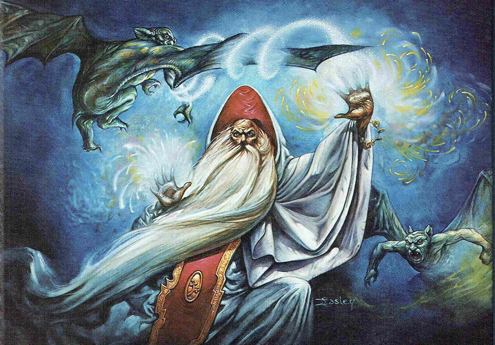
		</a>
		

			

				<header class="major">
					<h3>Week 2 - Tolkien, TTRPGs, and the Fantasy Tradition</h3>
				</header>
				
<strong>M - 08/24</strong> Discuss TTRPGs and Fantasy Literature

				
<strong>W - 08/26</strong> Discuss Tolkien, <em>The Lord of the Rings</em>

				
<strong>Readings</strong> <a href="#" target="_blank">Accessible via Canvas</a>

			

		

	</section>
	<section>
		<a href="generic.html" class="image">
			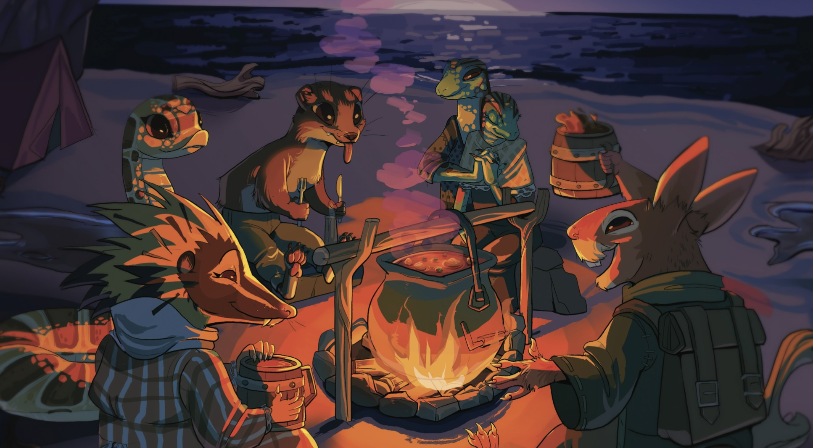
		</a>
		

			

				<header class="major">
					<h3>Week 3 - Wanderhome</h3>
				</header>
				
<strong>M - 08/31</strong> Character Creation

				
<strong>W - 09/02</strong> Journeying

				
<strong>Readings</strong> <a href="#" target="_blank">Accessible via Canvas</a>

			

		

	</section>
	<section>
		<a href="generic.html" class="image">
			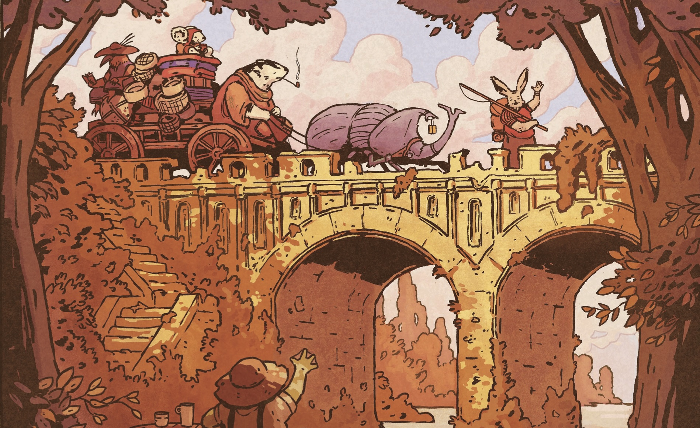
		</a>
		

			

				<header class="major">
					<h3>Week 4 - Wanderhome</h3>
				</header>
				
<strong>M - 09/07 NO CLASS – LABOR DAY</strong>

				
<strong>W - 09/09</strong> Placemaking

				
<strong>Readings</strong> <a href="#" target="_blank">Accessible via Canvas</a>

			

		

	</section>
	<section>
		<a href="generic.html" class="image">
			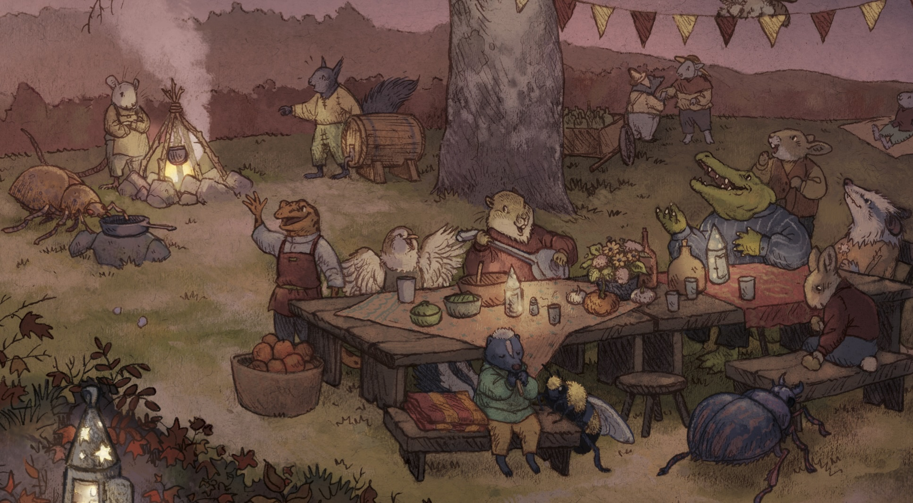
		</a>
		

			

				<header class="major">
					<h3>Week 5 - Wanderhome</h3>
				</header>
				
<strong>M - 09/14</strong> <em>Wanderhome</em> Debrief Discussion

				
<strong>W - 09/16</strong> Pitch Project Overview and Kickoff

			

		

	</section>
	<section>
		<a href="generic.html" class="image">
			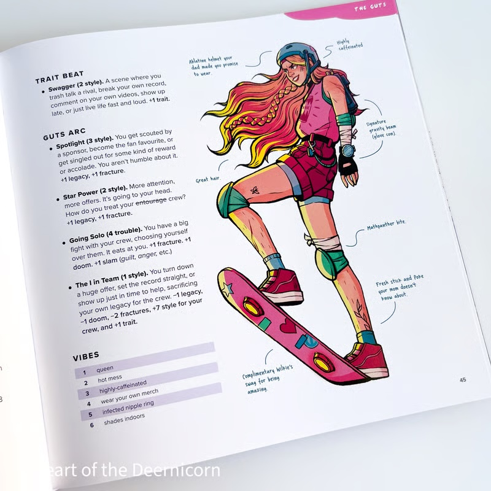
		</a>
		

			

				<header class="major">
					<h3>Week 6 - Design Project Development</h3>
				</header>
				
<strong>M - 09/21 NO CLASS – WELLNESS DAY</strong>

				
<strong>W - 09/23</strong> Surveying the Field of Play

				
<strong>Readings</strong> <a href="#" target="_blank">Accessible via Canvas</a>

			

		

	</section>
	<section>
		<a href="generic.html" class="image">
			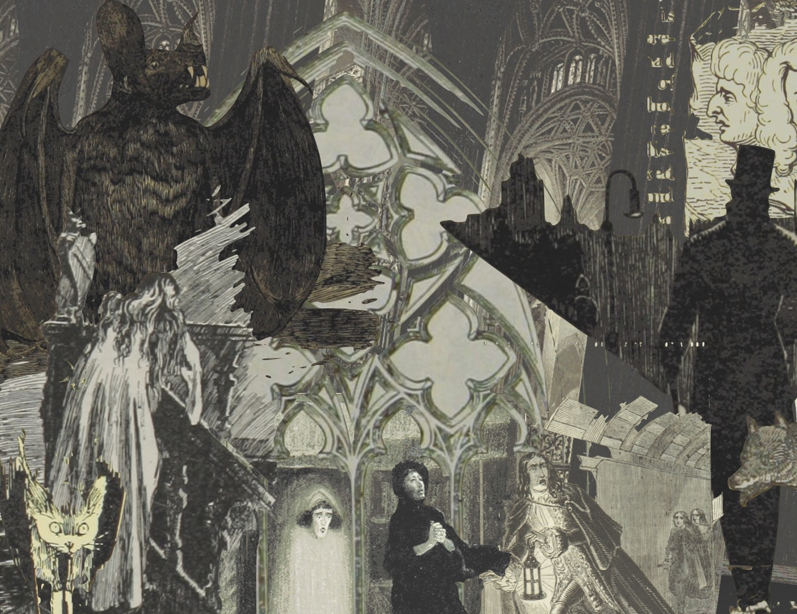
		</a>
		

			

				<header class="major">
					<h3>Week 7 - Playing with Memory, Gothic Fiction and Literary Form</h3>
				</header>
				
<strong>M - 09/28</strong> Discuss <em>Dracula</em> and Horror Fiction

				
<strong>W - 09/30</strong> Play and Discuss <em>Thousand-Year-Old Vampire</em>

				
<strong>Readings</strong> <a href="#" target="_blank">Accessible via Canvas</a>

			

		

	</section>
	<section>
		<a href="generic.html" class="image">
			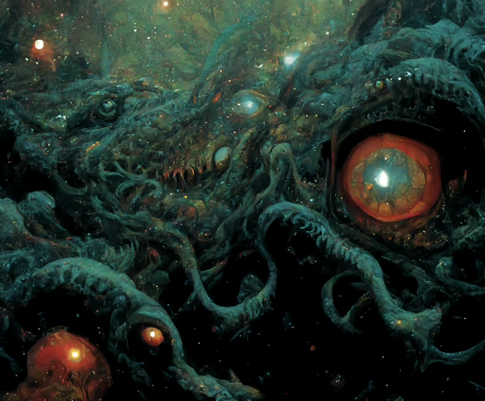
		</a>
		

			

				<header class="major">
					<h3>Week 8 - Cosmic Horror and the Psychopathology of Race</h3>
				</header>
				
<strong>M - 10/05</strong> Discuss "The Call of Cthulhu" and "The Dunwich Horror"

				
<strong>W - 10/07</strong> Play <em>Harlem Unbound</em>

				
<strong>Readings</strong> <a href="#" target="_blank">Accessible via Canvas</a>

			

		

	</section>
	<section>
		<a href="generic.html" class="image">
			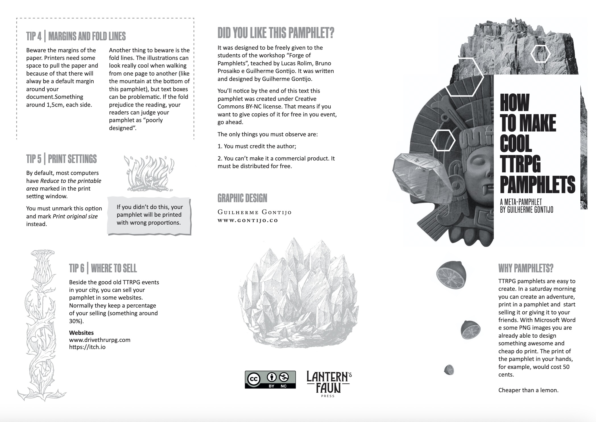
		</a>
		

			

				<header class="major">
					<h3>Week 9 - Design Project Development</h3>
				</header>
				
<strong>M - 10/12</strong> RPG Pitch Workshop

				
<strong>W - 10/14</strong> Pitch Drafting Studio

			

		

	</section>
	<section>
		<a href="generic.html" class="image">
			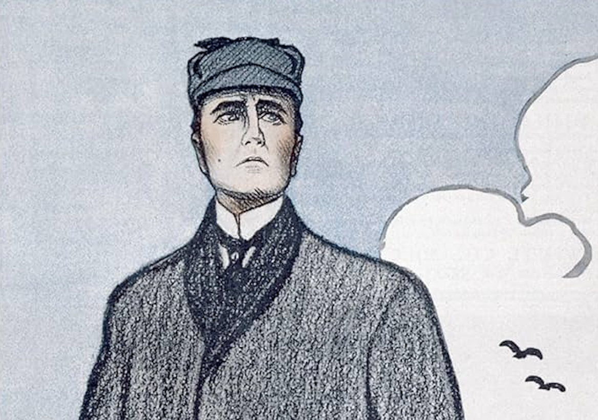
		</a>
		

			

				<header class="major">
					<h3>Week 10 - Clues in the Classical Detective Story</h3>
				</header>
				
<strong>M - 10/19</strong> Discuss Todorov, Suits, and Detective Fiction

				
<strong>W - 10/21</strong> Discuss Sherlock Holmes [selections]

				
<strong>Readings</strong> <a href="#" target="_blank">Accessible via Canvas</a>

			

		

	</section>
	<section>
		<a href="generic.html" class="image">
			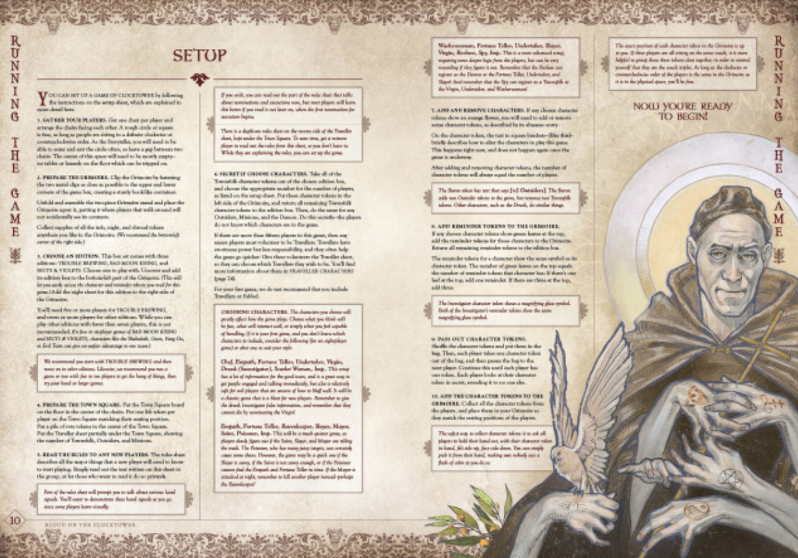
		</a>
		

			

				<header class="major">
					<h3>Week 11 - Playing at Murder, and Investigation</h3>
				</header>
				
<strong>M - 10/26</strong> Play <em>Blood on the Clocktower</em>

				
<strong>W - 10/28</strong> De-brief <em>Clocktower</em>

				
<strong>Readings</strong> <a href="#" target="_blank">Accessible via Canvas</a>

			

		

	</section>
	<section>
		
		

			

				<header class="major">
					<h3>Week 12 - Disco Elysium</h3>
				</header>
				
<strong>M - 11/02</strong> What Kind of Cop Are You?

				
<strong>W - 11/04</strong> Investigation as Indexical Storytelling

				
<strong>Readings</strong> <a href="#" target="_blank">Accessible via Canvas</a>

			

		

	</section>
	<section>
		<a href="generic.html" class="image">
			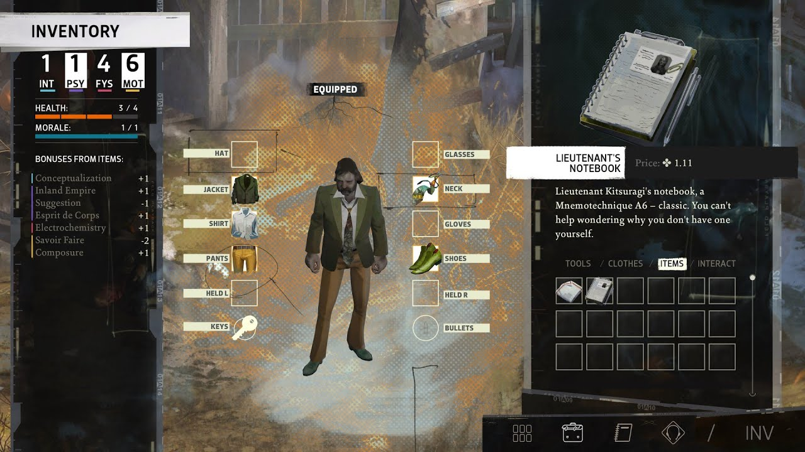
		</a>
		

			

				<header class="major">
					<h3>Week 13 - Disco Elysium</h3>
				</header>
				
<strong>M - 11/09</strong> Cognitive Mapping in the Thought Cabinet

				
<strong>W - 11/11</strong> <em>Disco Elysium</em> Debrief

			

		

	</section>
	<section>
		<a href="generic.html" class="image">
			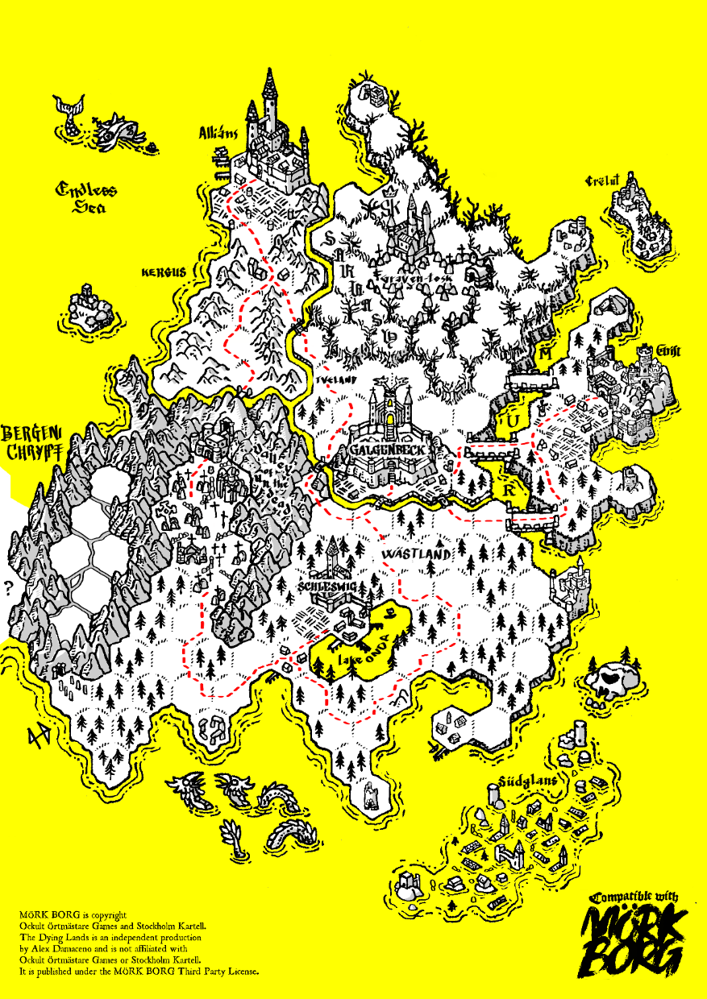
		</a>
		

			

				<header class="major">
					<h3>Week 14 - Design Project Development</h3>
				</header>
				
<strong>M - 11/16</strong> Prototyping Workshop I

				
<strong>W - 11/18</strong> Prototyping Workshop II

			

		

	</section>
	<section>
		<a href="generic.html" class="image">
			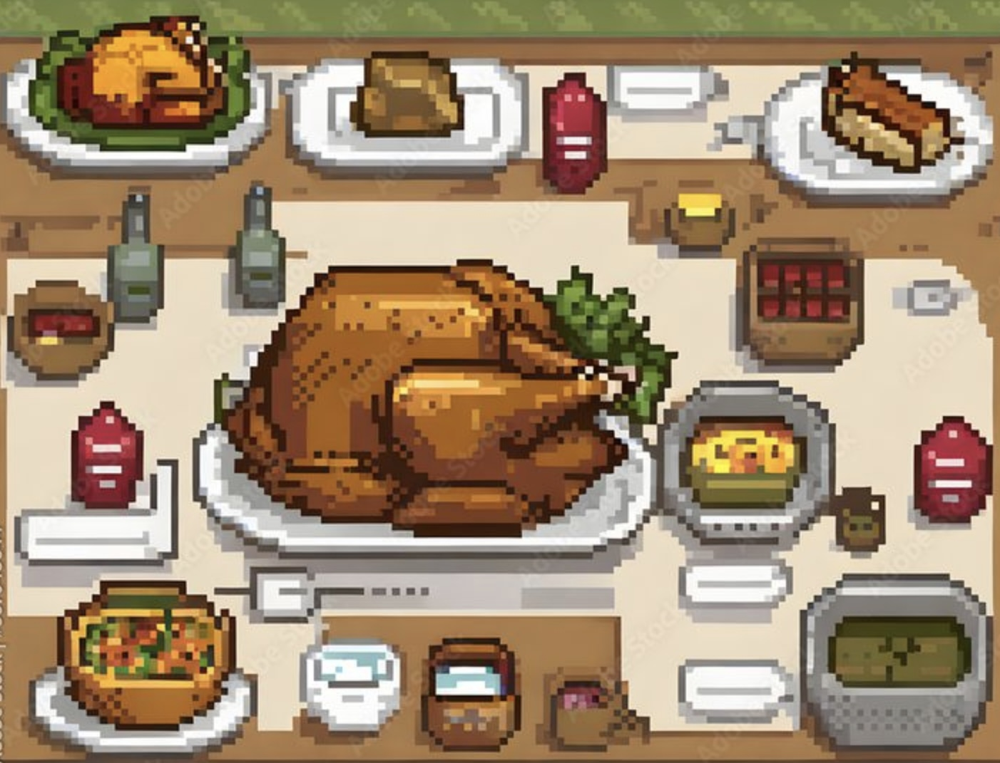
		</a>
		

			

				<header class="major">
					<h3>Week 15 - Thanksgiving Break</h3>
				</header>
				
<strong>M - 11/23 NO CLASS – THANKSGIVING HOLIDAY</strong>

				
<strong>W - 11/25 NO CLASS – THANKSGIVING HOLIDAY</strong>

			

		

	</section>
	<section>
		
		

			

				<header class="major">
					<h3>Week 16 - Conclusion to the Course</h3>
				</header>
				
<strong>M - 12/02</strong> Playtesting Workshop

				
<strong>W - 12/04</strong> Conclusion

			

		

	</section>
</section>

<!-- Three -->
<section id="three" style="text-align: center;">
	
	

		<header class="major">
			<h2>Final Exam Period</h2>
		</header>
		
<strong>F - 12/11</strong> Design Showcase, 12:00–3:00 PM ET (GL 316)

	

</section>

